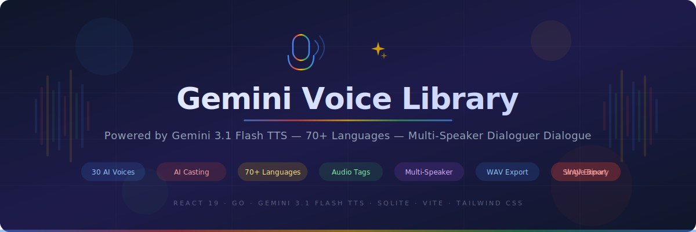
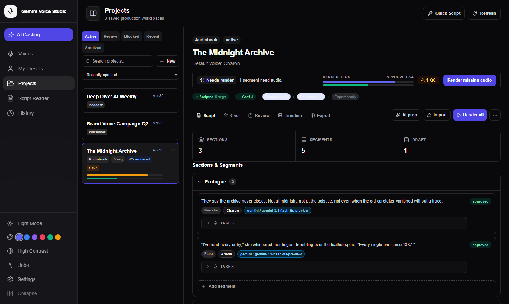

<p align="center">
  
</p>

# Gemini Voice Studio

An interactive web application for discovering, previewing, casting, and producing AI-generated audio using Google's Gemini Text-to-Speech API. Browse 30 curated voices, get AI-powered voice recommendations, build and manage multi-project voiceover productions, create multi-speaker dialogues, and export finished deliverables — all in a polished, accessible interface.

Ships as a **single cross-platform binary** (Windows, macOS, Linux) with a pure Go backend, embedded frontend, SQLite persistence, and encrypted API key storage.

> **Powered by [Gemini 3.1 Flash TTS](https://ai.google.dev/gemini-api/docs/speech-generation)** — Google's latest dedicated speech synthesis model with improved quality, lower latency, and a free tier.

---

<p align="center">
  
</p>
<p align="center"><em>Voice Library — browse 30 curated AI voices in an interactive 3D carousel or responsive grid</em></p>

---

## 📚 Documentation

Detailed guides for every feature live in [`/docs`](docs/). Start there for walkthroughs, keyboard shortcuts, and configuration reference.

| Guide | What's covered |
|-------|----------------|
| [Getting Started](docs/getting-started.md) | Installation, first launch, API key setup |
| [Voice Studio](docs/voice-library.md) | Browsing, filtering, favorites, AI Casting Director |
| [Script Reader](docs/script-reader.md) | Single-speaker, dialogue, A/B compare, audio tags |
| [Projects](docs/projects.md) | Project creation, sections, segments, batch render |
| [Cast Bible](docs/cast-bible.md) | Cast profiles, auditions, continuity warnings |
| [Review & Export](docs/review-export.md) | Take review, QC, timeline, export |
| [Settings & Administration](docs/settings-administration.md) | API keys, cache, backup, QC rules |
| [Keyboard Shortcuts](docs/keyboard-shortcuts.md) | All keyboard shortcuts and hotkeys |

---

## Features

### Voice Studio

- **Voice Browsing** — Explore 30 pre-loaded voices with detailed metadata (gender, pitch, characteristics) in a 3D carousel or responsive grid with face images
- **Smart Filtering** — Filter by gender, pitch, or free-text search; AI-recommended voices are highlighted when the Casting Director returns results
- **Favorites** — Star voices for quick access
- **Voice Compare** — Side-by-side comparison of two voices reading the same text

### Custom Voice Presets ("My Voices")

- **Save AI Results** — Save any AI-recommended voice as a custom preset via the Save Preset dialog (name is AI-suggested; edit before saving)
- **Preset Browser** — Switch between Stock and My Voices tabs to browse custom presets in the same 3D carousel / grid layout
- **Edit Presets** — Rename, add tags, set a color label, and edit the system instruction (persona direction) for each preset
- **Version History** — Each preset edit is versioned; revert to any previous snapshot
- **AI Portrait Artwork** — Gemini automatically generates a portrait image for each preset based on the persona description
- **Import / Export** — Export presets as JSON for backup or sharing; import from JSON

### AI Casting Director

- Describe your ideal voice in natural language; Gemini analyzes the 30-voice library and recommends the top 3 matches
- Results include a structured system prompt: Audio Profile, Scene, Director's Notes, Sample Context, and Transcript
- Each recommendation displays gender, pitch, traits, and a confidence score

### Script Reader

- **Single Speaker** — Type or paste script, choose a stock or custom voice, generate audio
- **Dialogue Mode** — Assign two distinct voices to speaker labels for natural two-voice conversation
- **A/B Compare** — Generate and compare the same text with two voices simultaneously
- **Accent Selector** — 16 world accents (General American, British RP, Australian, Irish, Scottish, Indian English, Canadian, South African, and more) injected as Director's Notes
- **Audio Tags** — Insert inline delivery annotations (`[whispers]`, `[excited]`, `[laughs]`, `[sighs]`, and more) via a collapsible toolbar grouped by Style, Emotion, and Sound
- **Script Syntax Highlighting** — Audio tags are highlighted in the text editor in real time
- **Script Formatting** — AI-powered script formatting tool normalizes whitespace, punctuation, and speaker labels
- **Templates** — Built-in script templates for common formats
- **Streaming TTS** — Optional streaming mode starts playback before generation completes
- **Playback Speed** — 0.5× – 2× speed adjustment
- **WAV Export** — Download any generated audio as a properly formatted WAV file
- **Drag & Drop** — Drop `.txt` or `.md` files directly into the script field
- **Multi-Language** — 70+ language selector or auto-detect

### Script Projects (Production Workflow)

<p align="center">
  
</p>
<p align="center"><em>Project workspace — manage multi-chapter scripts with per-segment voice assignment, batch rendering, and take history</em></p>

The Projects section provides a full production pipeline for multi-segment voiceover, audiobook, podcast, and training audio:

- **Project Types** — Audiobook, Voiceover, Podcast, Training, Custom
- **Section & Segment Management** — Organize scripts into named sections (chapters, scenes); each section contains individually renderable segments
- **Per-Segment Voice Assignment** — Assign a different voice, cast profile, provider, model, style, and language to each segment
- **Batch Render** — Render all draft or changed segments in a single click; real-time progress via WebSocket
- **AI Script Prep** — Paste raw manuscript text; Gemini analyzes it and proposes a complete section/segment structure with speaker candidates, pronunciation suggestions, and style recommendations — apply with one click
- **Text Import** — Import from Markdown or plain text; headings become sections, paragraphs become segments
- **Project Settings** — Per-project defaults for voice, language, model (3.1 Flash, 2.5 Flash, 2.5 Pro), and performance style
- **Client Workspaces** — Organize projects under client brands with default voice/model settings inherited by new projects
- **Project Stats** — Live section, segment, and draft counts displayed above the script editor
- **Take Management** — Each segment keeps a history of all rendered takes; switch between takes, view waveforms, and add reviewer notes
- **Multiple Takes Per Segment** — Re-render any segment to create a new take; approved takes are used for export

### Cast Bible

- **Cast Profiles** — Define named character/narrator profiles with role, description, voice assignment, sample lines, accent, language code, age impression, emotional range, and pronunciation notes
- **Role Groups** — Profiles organized by role: Narrator, Protagonist, Antagonist, Supporting, Extras, Brand Voice, Archived
- **Audition Panel** — Test any cast profile's voice with custom sample text, with download
- **Version History** — Revert any cast profile to a prior snapshot
- **Continuity Warnings** — Automatic detection of segments whose voice assignment drifts from their assigned cast profile

### Pronunciation Dictionaries

- **Project-Scoped Dictionaries** — Create word/phrase → pronunciation override rules per project
- **Global Dictionaries** — Pronunciation rules that apply across all projects (evaluated before project rules)
- **Real-Time Preview** — Test how rules affect sample text before saving
- **Multiple Dictionaries** — Toggle each dictionary on/off independently

### Performance Styles

- **Style Presets** — Reusable performance direction presets with category, pacing (slow → rapid), energy (subdued → high), emotion, articulation, pause density, and director notes
- **Global & Project-Scoped** — Create styles that apply across all projects or are specific to one
- **Version History** — Style edits are versioned; revert at any time

### Review & QC

- **Review Mode** — Full-screen take review workspace with keyboard shortcuts (Space, A, F, R, N, P, M)
- **Review Queue** — Filterable segment list (All / Unreviewed / Flagged / Open Issues)
- **Approve / Flag** — Approve takes to mark them ready for export; flag takes with issues
- **QC Issues** — Create QC issues per segment with severity (Low / Medium / High), status (Open / Resolved / Won't Fix), and notes
- **QC Rules** — Configure default severity, clipping auto-detection threshold (dBFS), export-only-approved policy, and notes export format
- **Timeline Review** — Scrollable waveform timeline of all segments; click waveforms to seek; view export readiness at a glance

### Export

- **Stitch to WAV** — Export entire project as a single stitched WAV with optional finishing profile
- **Export Profiles** — Named finishing presets (bit depth, sample rate, normalization, metadata) for consistent deliverables
- **ZIP Packaging** — Export dialog produces a downloadable ZIP of all approved segments
- **Export Readiness Checklist** — Visual indicator of how many segments are approved and ready
- **Job Monitoring** — Background export jobs with real-time progress; re-download prior exports

### Settings & Administration

- **API Key Management** — Store Gemini API keys with AES-256-GCM encryption; test keys before saving
- **Key Pool** — Add multiple API keys; backend auto-rotates across pool for load distribution
- **Cache Management** — View cache size statistics and clear cached audio files
- **Render Defaults** — Global default model, voice, language, and quality settings
- **Backup & Restore** — Full database backup (JSON/SQL) and one-click restore
- **QC Rules** — Global quality-control defaults for all projects

### Accessibility & UX

- **Keyboard Navigation** — Arrow keys in carousel, Enter/Space for playback, full focus trap in modals
- **Command Palette** — `Cmd/Ctrl+K` to open keyboard-driven action search
- **Keyboard Shortcuts Modal** — Complete reference card for all shortcuts
- **ARIA Labels** — All interactive elements fully labeled for screen readers
- **Dark / Light Mode** — Full theme support with smooth transitions
- **High Contrast Mode** — Accessibility-focused contrast toggle
- **Accent Colors** — Six color themes (Indigo, Blue, Violet, Rose, Emerald, Amber)
- **Mini Player** — Floating persistent audio player for continued playback while navigating
- **Onboarding Tour** — First-run guided walkthrough
- **Responsive Layout** — Mobile-first design; phone, tablet, and desktop breakpoints
- **Toast Notifications** — Non-blocking success/error feedback system
- **Job Center** — Drawer showing all background jobs with progress bars and cancel/clear actions

---

## Tech Stack

| Layer | Technology |
|-------|-----------|
| Frontend | React 19 with TypeScript 5.8 |
| Build Tool | Vite 6 |
| Styling | Tailwind CSS (CDN) with custom theme config |
| Animations | Framer Motion 11 |
| Icons | Lucide React |
| Audio | Web Audio API, HTML5 Canvas waveform visualizer |
| Backend | Go 1.22+ (pure Go, no CGo) |
| Database | SQLite via `modernc.org/sqlite` |
| Encryption | AES-256-GCM (stdlib `crypto/aes`) |
| HTTP Server | `net/http` stdlib with Go 1.22 pattern matching |

### Gemini Models Used

| Model | Purpose |
|-------|---------|
| `gemini-3-flash-preview` | AI voice recommendations, script prep (structured JSON output) |
| `gemini-3.1-flash-tts-preview` | Text-to-Speech audio generation (single, multi-speaker, streaming) |
| `gemini-3.1-flash-image-preview` | AI portrait artwork for custom voice presets |

---

## Prerequisites

- [Node.js](https://nodejs.org/) 18+
- [Go](https://go.dev/) 1.22+
- A [Google AI Studio](https://aistudio.google.com/) API key with access to Gemini models

---

## Getting Started

### Quick Start (Development)

1. **Clone the repository**

   ```bash
   git clone https://github.com/ajbergh/Gemini-Voice-Gen-TTS.git
   cd Gemini-Voice-Gen-TTS
   ```

2. **Install frontend dependencies**

   ```bash
   npm install
   ```

3. **Start the Go backend** (terminal 1)

   ```bash
   cd backend
   go run ./cmd/server
   ```

   Or use the dev script from the repo root:

   ```powershell
   # Windows
   .\scripts\start-backend-dev.ps1
   ```

4. **Start the frontend dev server** (terminal 2)

   ```bash
   npm run dev
   ```

   The frontend runs at [http://localhost:4000](http://localhost:4000) and proxies `/api` calls to the backend on port 8080.

5. **Configure your API key** — Open the app and click **Settings** (gear icon in the sidebar) to save your Gemini API key. It is AES-256-GCM encrypted and stored locally in SQLite.

### Production Build (Single Binary)

Build a self-contained binary with the frontend embedded. Use the platform-specific scripts in `scripts/`:

**Windows (PowerShell):**
```powershell
.\scripts\build-windows.ps1            # Default: amd64
.\scripts\build-windows.ps1 -Arch arm64
.\scripts\build-windows.ps1 -Clean     # Clean build artifacts first
```

**Linux (Bash):**
```bash
chmod +x scripts/build-linux.sh
./scripts/build-linux.sh                # Default: amd64
./scripts/build-linux.sh --arch arm64
./scripts/build-linux.sh --clean
```

**macOS (Bash):**
```bash
chmod +x scripts/build-macos.sh
./scripts/build-macos.sh                # Default: arm64 (Apple Silicon)
./scripts/build-macos.sh --arch amd64   # Intel Mac
./scripts/build-macos.sh --universal    # Universal binary (amd64 + arm64)
./scripts/build-macos.sh --clean
```

All scripts output to `bin/`. Run the binary:

```bash
./bin/gemini-voice-library-<os>-<arch> --port 8080 --open
```

### CLI Flags

| Flag | Default | Description |
|------|---------|-------------|
| `--port` | `8080` | HTTP server port |
| `--db` | `<platform data dir>/gemini-voice-gen-tts/data.db` | SQLite database path |
| `--passphrase` | *(machine-derived)* | Passphrase for API key encryption |
| `--log-level` | `info` | Log level (`debug`, `info`, `warn`, `error`) |
| `--open` | `false` | Auto-open browser on startup |

---

## Scripts

| Command | Description |
|---------|-------------|
| `npm run dev` | Start Vite dev server |
| `npm run build` | Build frontend for production |
| `npm run preview` | Preview the production build locally |
| `.\scripts\start-backend-dev.ps1` | Start Go backend in dev mode (Windows) |
| `go run ./cmd/server` | Run Go backend (from `backend/`) |
| `go build ./cmd/server` | Build the Go backend binary |
| `scripts/build-windows.ps1` | Full production build for Windows |
| `scripts/build-linux.sh` | Full production build for Linux |
| `scripts/build-macos.sh` | Full production build for macOS |

---

## Project Structure

```
├── index.html              # HTML entry with Tailwind config, fonts & importmap
├── index.tsx               # React root mount
├── App.tsx                 # Main application component (state, routing, modals)
├── api.ts                  # Frontend API client (all backend endpoints)
├── constants.ts            # Voice library data (30 voices with metadata)
├── types.ts                # TypeScript interfaces
├── vite.config.ts          # Vite config (React plugin, API proxy)
├── scripts/
│   ├── start-backend-dev.ps1 # Windows dev launcher for Go backend
│   ├── build-windows.ps1   # Windows production build (PowerShell)
│   ├── build-linux.sh      # Linux production build (Bash)
│   └── build-macos.sh      # macOS production build (universal binary support)
├── components/
│   ├── FilterBar.tsx             # Top nav bar (search, filters, view toggle, theme)
│   ├── NavigationSidebar.tsx     # Side navigation panel
│   ├── Carousel3D.tsx            # 3D perspective carousel (Framer Motion)
│   ├── GridView.tsx              # Responsive grid layout for voices
│   ├── VoiceCard.tsx             # Individual voice card (grid view)
│   ├── VoiceFinder.tsx           # AI Casting Director modal
│   ├── AiResultCard.tsx          # AI recommendation result display
│   ├── AiTtsPreview.tsx          # TTS generation, streaming, playback, download
│   ├── AudioProvider.tsx         # Shared Web Audio API context
│   ├── AudioVisualizer.tsx       # Canvas waveform with Google color cycling
│   ├── AudioTagsToolbar.tsx      # Inline audio tag insertion toolbar
│   ├── ScriptReaderModal.tsx     # Script Reader (single/dialogue/compare modes)
│   ├── ScriptHighlighter.tsx     # Audio tag syntax highlighting overlay
│   ├── VoiceCompare.tsx          # Side-by-side voice comparison
│   ├── SettingsModal.tsx         # API key management
│   ├── HistoryPanel.tsx          # Generation history browser
│   ├── CommandPalette.tsx        # Keyboard command palette
│   ├── KeyboardShortcutsModal.tsx # Keyboard shortcuts reference
│   ├── MiniPlayer.tsx            # Floating persistent audio player
│   ├── OnboardingTour.tsx        # First-run guided tour
│   ├── ToastProvider.tsx         # Toast notification system
│   ├── JobCenter.tsx             # Background job monitor drawer
│   ├── JobProvider.tsx           # Job state context provider
│   ├── PresetCard.tsx            # Custom preset card (grid view)
│   ├── PresetCarousel3D.tsx      # 3D carousel for custom presets
│   ├── PresetGrid.tsx            # Grid layout for custom presets
│   ├── PresetEditModal.tsx       # Edit preset (name, tags, color, instruction)
│   ├── PresetArtwork.tsx         # Gemini-generated portrait artwork display
│   ├── SavePresetDialog.tsx      # Save AI result as custom preset
│   ├── ProjectWorkspace.tsx      # Full project production shell
│   ├── SectionBlock.tsx          # Editable section container
│   ├── SegmentRow.tsx            # Individual segment editor with take controls
│   ├── SegmentTakeList.tsx       # Take history list with waveforms and notes
│   ├── ProjectStatsBar.tsx       # Project section/segment/draft stats
│   ├── ProjectImportPanel.tsx    # Text import panel (Markdown/plain text)
│   ├── ScriptPrepDialog.tsx      # AI script prep (section/segment generation)
│   ├── CastBoard.tsx             # Cast bible board (profiles by role)
│   ├── CastProfileEditor.tsx     # Cast profile create/edit modal
│   ├── CastAuditionPanel.tsx     # Cast voice audition panel
│   ├── CastContinuityWarnings.tsx # Voice drift detection banner
│   ├── PronunciationEditor.tsx   # Project pronunciation dictionary
│   ├── GlobalPronunciationSettings.tsx # Global pronunciation dictionaries
│   ├── StylePresetPicker.tsx     # Performance style dropdown
│   ├── StylePresetEditor.tsx     # Create/edit performance style presets
│   ├── ReviewMode.tsx            # Full-screen take review workspace
│   ├── ReviewQueue.tsx           # Filterable segment review queue
│   ├── ReviewTransport.tsx       # Playback and approval transport controls
│   ├── TimelineReview.tsx        # Waveform timeline and export readiness
│   ├── WaveformCanvas.tsx        # Canvas waveform renderer
│   ├── QcIssueList.tsx           # QC issue display and actions
│   ├── QcIssueDialog.tsx         # QC issue create/edit dialog
│   ├── QcRulesSettings.tsx       # QC default rules configuration
│   ├── ExportDialog.tsx          # Deliverable export job UI
│   ├── ExportProfilePicker.tsx   # Export finishing profile selector
│   ├── ClientWorkspaceList.tsx   # Client workspace selector
│   ├── ClientProfileEditor.tsx   # Client profile create/edit modal
│   ├── ProjectSettingsPanel.tsx  # Project defaults (voice, language, model, style)
│   └── projects/
│       └── ProjectSettingsDrawer.tsx # Slide-in drawer for project settings
└── backend/
    ├── cmd/server/main.go          # Entry point — CLI flags, graceful shutdown
    ├── Makefile                    # Cross-platform build targets
    ├── go.mod / go.sum
    └── internal/
        ├── config/config.go        # App config (JSON, platform-aware defaults)
        ├── crypto/crypto.go        # AES-256-GCM encryption
        ├── embed/frontend.go       # go:embed for bundled frontend assets
        ├── gemini/                 # Gemini API client (TTS, recommend, image)
        ├── handler/                # HTTP handlers for all API routes
        ├── server/                 # HTTP server, router, middleware, rate limiting
        └── store/                  # SQLite store with embedded migrations
```

---

## API Reference

```
GET    /api/health                                 Health check
GET    /api/config                                 Read app config
PUT    /api/config                                 Update app config

GET    /api/keys                                   List API key providers
POST   /api/keys                                   Store encrypted API key
DELETE /api/keys/{provider}                        Remove API key
GET    /api/keys/{provider}/test                   Validate API key
GET    /api/keys/{provider}/pool                   List key pool entries
POST   /api/keys/{provider}/pool                   Add key to pool
DELETE /api/keys/{provider}/pool                   Remove key from pool
POST   /api/keys/{provider}/pool/reset             Reset pool key usage

GET    /api/voices                                 List voices
POST   /api/voices/recommend                       AI voice recommendations
POST   /api/voices/tts                             Single-speaker TTS
POST   /api/voices/tts/multi                       Multi-speaker dialogue TTS
POST   /api/voices/tts/stream                      Streaming TTS
POST   /api/voices/format-script                   AI script formatting

GET    /api/presets                                List custom presets
POST   /api/presets                                Create preset
GET    /api/presets/tags                           List preset tags
GET    /api/presets/export                         Export presets as JSON
POST   /api/presets/import                         Import presets from JSON
PATCH  /api/presets/reorder                        Reorder presets
GET    /api/presets/{id}                           Get preset
PUT    /api/presets/{id}                           Update preset
DELETE /api/presets/{id}                           Delete preset
GET    /api/presets/{id}/audio                     Cached preset audio
PUT    /api/presets/{id}/tags                      Set preset tags
GET    /api/presets/{id}/versions                  Version history
POST   /api/presets/{id}/versions/{v}/revert       Revert to version

GET    /api/history                                List history (paginated)
DELETE /api/history                                Clear all history
GET    /api/history/export                         Export history as JSON
GET    /api/history/{id}                           Single history entry
GET    /api/history/{id}/audio                     Cached audio (base64)
DELETE /api/history/{id}                           Delete entry

GET    /api/favorites                              List favorites
POST   /api/favorites                              Toggle favorite

GET    /api/providers                              List AI providers
GET    /api/clients                                List client workspaces
POST   /api/clients                                Create client
GET    /api/clients/{id}                           Get client
PUT    /api/clients/{id}                           Update client
DELETE /api/clients/{id}                           Delete client

GET    /api/projects                               List projects
POST   /api/projects                               Create project
PUT    /api/projects/{id}                          Update project
DELETE /api/projects/{id}                          Delete project
POST   /api/projects/{id}/archive                 Archive project
GET    /api/projects/{id}/summaries               Project render statistics

GET    /api/projects/{id}/sections                List sections
POST   /api/projects/{id}/sections               Create section
PUT    /api/projects/{id}/sections/{sid}          Update section
DELETE /api/projects/{id}/sections/{sid}          Delete section

GET    /api/projects/{id}/segments                List segments
POST   /api/projects/{id}/segments               Create segment
PUT    /api/projects/{id}/segments/{sid}          Update segment
DELETE /api/projects/{id}/segments/{sid}          Delete segment
POST   /api/projects/{id}/segments/{sid}/render   Render segment audio

GET    /api/projects/{id}/segments/{sid}/takes         List takes
POST   /api/projects/{id}/segments/{sid}/takes         Create take
GET    /api/projects/{id}/segments/{sid}/takes/{tid}/audio  Take audio (base64)
PUT    /api/projects/{id}/segments/{sid}/takes/{tid}   Update take
DELETE /api/projects/{id}/segments/{sid}/takes/{tid}   Delete take
POST   /api/projects/{id}/segments/{sid}/takes/{tid}/approve  Approve take
POST   /api/projects/{id}/segments/{sid}/takes/{tid}/flag     Flag take

GET    /api/projects/{id}/cast                    List cast profiles
POST   /api/projects/{id}/cast                    Create cast profile
GET    /api/cast/{profileId}                      Get cast profile
PUT    /api/cast/{profileId}                      Update cast profile
DELETE /api/cast/{profileId}                      Delete cast profile
GET    /api/cast/{profileId}/versions             Version history
POST   /api/cast/{profileId}/versions/{v}/revert  Revert to version
POST   /api/cast/{profileId}/audition             Audition cast profile voice

GET    /api/projects/{id}/qc                      List QC issues
POST   /api/projects/{id}/qc                      Create QC issue
GET    /api/qc/{issueId}                          Get QC issue
PUT    /api/qc/{issueId}                          Update QC issue
DELETE /api/qc/{issueId}                          Delete QC issue

GET    /api/projects/{id}/exports                 List export jobs
POST   /api/projects/{id}/exports                 Start export job
GET    /api/exports/{jobId}                       Get export job status
GET    /api/exports/{jobId}/download              Download export ZIP

POST   /api/projects/{id}/batch-render            Batch render segments
POST   /api/projects/{id}/prep                    AI script prep
POST   /api/projects/{id}/import                  Import script text
POST   /api/projects/{id}/stitch                  Stitch segments to WAV

GET    /api/pronunciation/global                  List global dictionaries
POST   /api/pronunciation/global                  Create global dictionary
PUT    /api/pronunciation/global/{id}             Update global dictionary
DELETE /api/pronunciation/global/{id}             Delete global dictionary
GET    /api/pronunciation/global/{id}/entries     List global entries
POST   /api/pronunciation/global/{id}/entries     Add global entry
PUT    /api/pronunciation/global/{id}/entries/{eid}   Update entry
DELETE /api/pronunciation/global/{id}/entries/{eid}   Delete entry

GET    /api/projects/{id}/pronunciation           List project dictionaries
POST   /api/projects/{id}/pronunciation           Create project dictionary
PUT    /api/pronunciation/{id}                    Update dictionary
DELETE /api/pronunciation/{id}                    Delete dictionary
GET    /api/pronunciation/{id}/entries            List entries
POST   /api/pronunciation/{id}/entries            Add entry
PUT    /api/pronunciation/entries/{eid}           Update entry
DELETE /api/pronunciation/entries/{eid}           Delete entry
POST   /api/pronunciation/{id}/preview            Preview pronunciation rules

GET    /api/styles                                List global performance styles
POST   /api/styles                                Create global style
GET    /api/projects/{id}/styles                  List project styles
POST   /api/projects/{id}/styles                  Create project style
GET    /api/styles/{id}                           Get style
PUT    /api/styles/{id}                           Update style
DELETE /api/styles/{id}                           Delete style
GET    /api/styles/{id}/versions                  Style version history
POST   /api/styles/{id}/versions/{v}/revert       Revert style to version

GET    /api/export-profiles                       List export profiles
POST   /api/export-profiles                       Create export profile
PUT    /api/export-profiles/{id}                  Update profile
DELETE /api/export-profiles/{id}                  Delete profile

GET    /api/jobs                                  List background jobs
PATCH  /api/jobs/{id}/cancel                      Cancel job

GET    /api/cache/stats                           Cache storage stats
DELETE /api/cache                                 Clear audio cache
POST   /api/backup                                Create database backup
POST   /api/restore                              Restore from backup

WS     /api/ws/progress                           Real-time job progress
```

---

## Documentation

See [`/docs`](docs/) for detailed guides on every feature → [docs/index.md](docs/index.md)

---

## License

Apache-2.0
