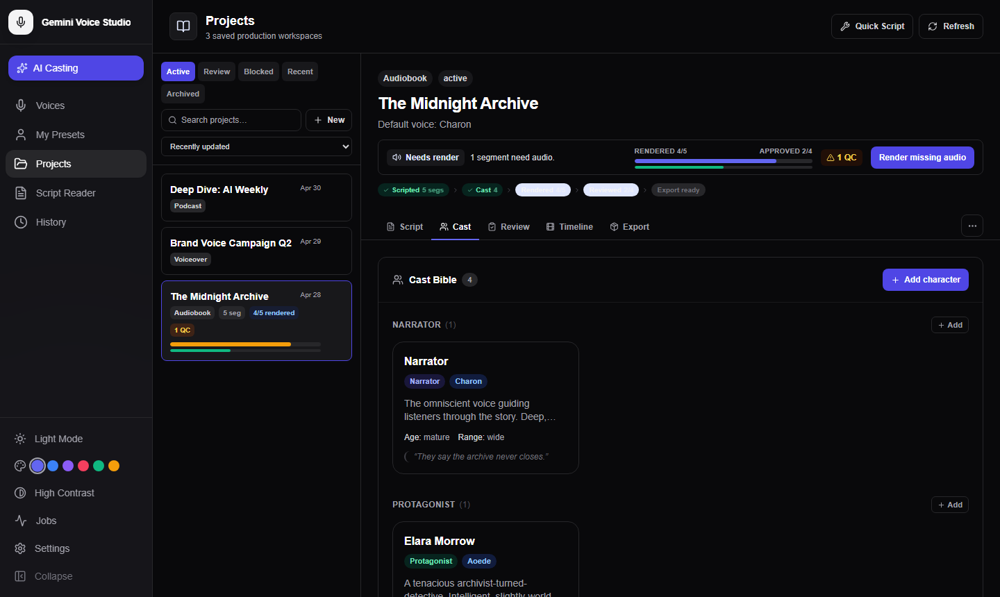

# Cast Bible

The Cast Bible is a project-level registry of all named character and narrator voice profiles. It ensures consistent voice assignment across segments, tracks character versions, and provides audition tools.

*The Cast Bible groups profiles by role — each card shows the assigned voice, age impression, emotional range, and a sample line*

---

## Opening the Cast Bible

In any open project, click the **Cast** tab in the project navigation bar. The Cast Board loads all profiles for the project, grouped by role.

---

## Role Groups

Cast profiles are organized into the following role categories:

| Role | Description |
|------|-------------|
| **Narrator** | Story narrator, documentary voice, guide |
| **Protagonist** | Main character |
| **Antagonist** | Villain or opposing character |
| **Supporting** | Secondary characters |
| **Extras** | Minor characters, crowd voices |
| **Brand Voice** | Corporate/brand narrator or spokesperson |
| **Archived** | Retired profiles kept for reference |

New projects always show empty **Narrator** and **Protagonist** groups as an entry point hint.

---

## Creating a Cast Profile

1. Click the **+** button in any role group header
2. Fill in the profile form:

| Field | Description |
|-------|-------------|
| **Name** | Character or narrator name (required) |
| **Role** | Role category (dropdown) |
| **Description** | Brief character summary or notes |
| **Voice** | Stock voice or custom preset to use for this character |
| **Style** | Performance style preset (optional) |
| **Sample Lines** | One line per row — used for auditions and seeding TTS preview |
| **Age Impression** | Child, Teen, Young Adult, Adult, Senior |
| **Emotional Range** | Narrow, Moderate, Wide |
| **Accent / Language** | Accent code or language code override |
| **Pronunciation Notes** | Free-text notes for pronunciation guidance |

3. Click **Save** to create the profile

---

## Editing a Cast Profile

1. Click the **Edit** (pencil) icon on any profile card
2. Modify any field
3. Click **Save**

Each save creates a new version snapshot. The previous state is preserved in version history.

---

## Version History

Click the **History** icon on a profile card (or within the edit form) to view all previous versions of the profile.

- Each version shows a timestamp and a diff of what changed
- Click **Revert** next to any version to restore the profile to that state
- Reverting creates a new version (the revert itself is recorded)

---

## Auditioning a Profile

Test a cast profile's voice before assigning it to segments.

1. Click the **Audition** (play) button on a profile card
2. The Audition Panel opens with the first sample line pre-filled
3. Edit the sample text if desired
4. Click **Generate** — audio is rendered using the profile's voice and style
5. Click **Play** to listen
6. Click **Download WAV** to save the result

---

## Assigning Cast Profiles to Segments

In the **Script** tab, each segment row has a **Cast Profile** field:

1. Edit a segment (pencil icon)
2. In the **Cast Profile** dropdown, select a named profile
3. Save the segment

When a cast profile is assigned, the segment uses that profile's voice and style automatically. Explicit voice overrides on the segment take precedence over the profile.

---

## Continuity Warnings

The **Cast Continuity Warnings** banner appears at the top of the Cast Board when drift is detected.

Two types of issues are flagged:

| Issue Type | Description |
|------------|-------------|
| **Label Drift** | Segment's speaker label matches a cast profile name, but the segment's assigned voice differs from the profile's voice |
| **Stale Profile Override** | Segment was linked to a cast profile, but the profile's voice has since changed |

**Resolving warnings:**
- Click the warning to see the segment text and the expected vs. actual voice
- Re-save the segment to sync it with the current profile voice, or
- Update the cast profile if the intent was to change the voice globally

---

## Deleting a Cast Profile

1. Click the **Delete** (trash) icon on a profile card
2. Confirm the deletion in the dialog

Deleting a profile does not change segments that referenced it — those segments retain their last-resolved voice name but lose the profile link.

---

## Tips

- Create the **Narrator** and **Protagonist** profiles first for new projects — they appear as empty groups by default to remind you
- Use **Sample Lines** to collect representative lines per character; the Audition panel auto-fills from the first line
- Assign a **Performance Style** to each cast profile to bake in consistent delivery direction for that character
- Use **Version History** to A/B test voice changes — revert to a prior voice if the change doesn't work in context
