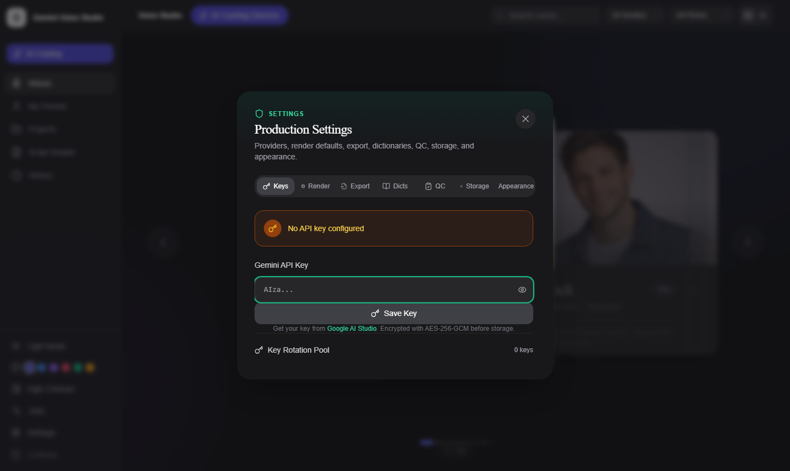

# Getting Started

This guide walks you through installing, configuring, and running Gemini Voice Studio for the first time.


*Gemini Voice Studio — browse 30 curated Gemini TTS voices, generate speech, and manage full production projects from a single interface*

---

## Prerequisites

| Requirement | Version | Notes |
|-------------|---------|-------|
| Node.js | 18+ | For the frontend dev server and build tools |
| Go | 1.22+ | For the backend server |
| Gemini API Key | — | Free tier available at [Google AI Studio](https://aistudio.google.com/) |

---

## Installation

### 1. Clone the Repository

```bash
git clone https://github.com/ajbergh/Gemini-Voice-Gen-TTS.git
cd Gemini-Voice-Gen-TTS
```

### 2. Install Frontend Dependencies

```bash
npm install
```

---

## Running in Development Mode

Development mode runs the frontend and backend as two separate processes, with the Vite dev server proxying `/api` calls to the Go backend.

**Terminal 1 — Start the Go backend:**

```bash
cd backend
go run ./cmd/server
```

The backend listens on `http://localhost:8080`. On first run it creates a SQLite database in your platform's app data directory.

**Windows shortcut:**
```powershell
.\scripts\start-backend-dev.ps1
```

**Terminal 2 — Start the frontend dev server:**

```bash
npm run dev
```

The frontend runs at **[http://localhost:4000](http://localhost:4000)**.

---

## First Launch

1. Open [http://localhost:4000](http://localhost:4000) in your browser.
2. The **Onboarding Tour** starts automatically on first launch — follow the walkthrough to get oriented.
3. Click **Settings** (gear icon in the left sidebar) to open the API key setup.

---

## Configuring Your API Key

The app never calls Gemini directly from the browser. All AI calls go through the Go backend, which stores your key encrypted at rest using AES-256-GCM.

1. In the **Settings** modal, paste your Gemini API key.
2. Click **Test Key** to validate it against the Gemini API.
3. Click **Save** — the key is encrypted and stored in the local SQLite database.


*Open Settings from the gear icon in the sidebar — keys are encrypted with AES-256-GCM before storage*

> **Get a free key:** Visit [Google AI Studio](https://aistudio.google.com/apikey) → Create API Key. The free tier includes access to Gemini 3.1 Flash TTS.

### Key Pools (Optional)

For high-volume use, you can add multiple API keys to a pool. The backend automatically rotates across them to stay within rate limits.

1. Open **Settings → API Keys**.
2. Click **Add to Pool** and paste an additional key.
3. Repeat for as many keys as you have.

---

## Production Build (Single Binary)

Build a self-contained executable with the frontend embedded — no Node.js or npm required on the target machine.

**Windows:**
```powershell
.\scripts\build-windows.ps1
.\scripts\build-windows.ps1 -Arch arm64    # ARM64
.\scripts\build-windows.ps1 -Clean         # Clean before build
```

**Linux:**
```bash
chmod +x scripts/build-linux.sh
./scripts/build-linux.sh
./scripts/build-linux.sh --arch arm64
./scripts/build-linux.sh --clean
```

**macOS:**
```bash
chmod +x scripts/build-macos.sh
./scripts/build-macos.sh                   # ARM64 (Apple Silicon)
./scripts/build-macos.sh --arch amd64      # Intel
./scripts/build-macos.sh --universal       # Universal binary
./scripts/build-macos.sh --clean
```

Binaries are output to `bin/`. Run it:

```bash
./bin/gemini-voice-library-linux-amd64 --port 8080 --open
```

The `--open` flag automatically opens your browser.

### CLI Flags

| Flag | Default | Description |
|------|---------|-------------|
| `--port` | `8080` | HTTP server port |
| `--db` | `<platform data dir>/gemini-voice-gen-tts/data.db` | SQLite database path |
| `--passphrase` | *(machine-derived)* | Encryption passphrase for API keys |
| `--log-level` | `info` | Log level: `debug`, `info`, `warn`, `error` |
| `--open` | `false` | Open browser automatically on start |

---

## Docker

A `Dockerfile` and `docker-compose.yml` are included for containerized deployment.

```bash
docker compose up --build
```

The app will be available at `http://localhost:8080`. Mount a volume to persist the database:

```yaml
volumes:
  - ./data:/root/.local/share/gemini-voice-gen-tts
```

---

## Data Storage

All application data is stored in a local SQLite database:

| Platform | Default Path |
|----------|-------------|
| Windows | `%APPDATA%\gemini-voice-gen-tts\data.db` |
| macOS | `~/Library/Application Support/gemini-voice-gen-tts/data.db` |
| Linux | `~/.local/share/gemini-voice-gen-tts/data.db` |

You can override the path with `--db /path/to/your.db`.

Stored data includes:
- Encrypted API keys and key pool entries
- Voice library with favorites
- Generation history and cached audio files
- Custom voice presets and their version history
- Script projects, sections, segments, and takes
- Cast profiles, pronunciation dictionaries, performance styles
- QC issues, export profiles, background job history
- App configuration and render defaults

---

## Backup and Restore

To back up all data, use the API or the **Settings → Backup** button in the UI:

```bash
curl -X POST http://localhost:8080/api/backup -o backup.json
```

To restore:

```bash
curl -X POST http://localhost:8080/api/restore -d @backup.json
```

---

## Next Steps

| Guide | Description |
|-------|-------------|
| [Voice Studio](voice-library.md) | Browse and preview voices |
| [Script Reader](script-reader.md) | Generate speech from scripts |
| [Projects](projects.md) | Production workflow for multi-segment audio |
| [Cast Bible](cast-bible.md) | Manage character voice profiles |
| [Settings & Administration](settings-administration.md) | API keys, cache, QC rules |
