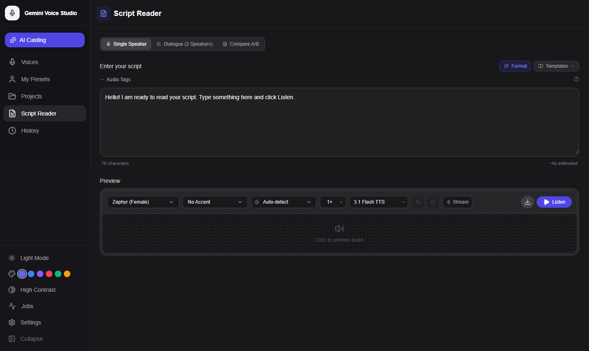
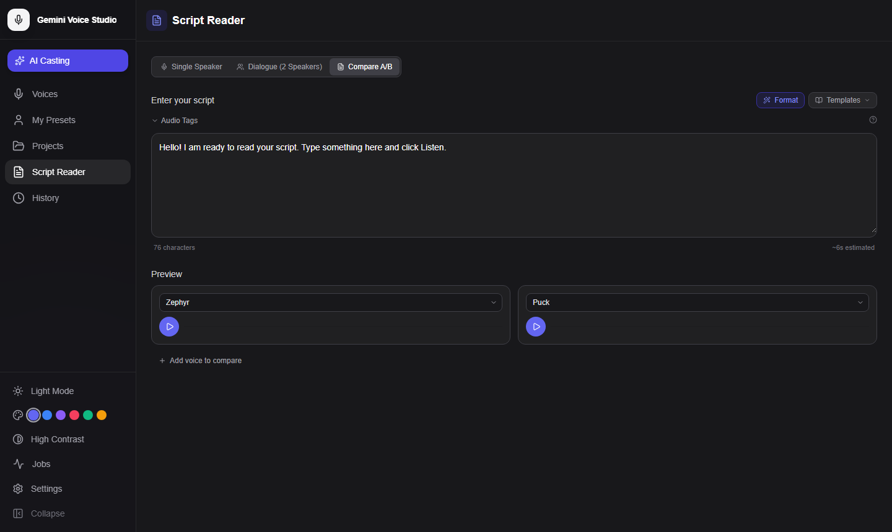
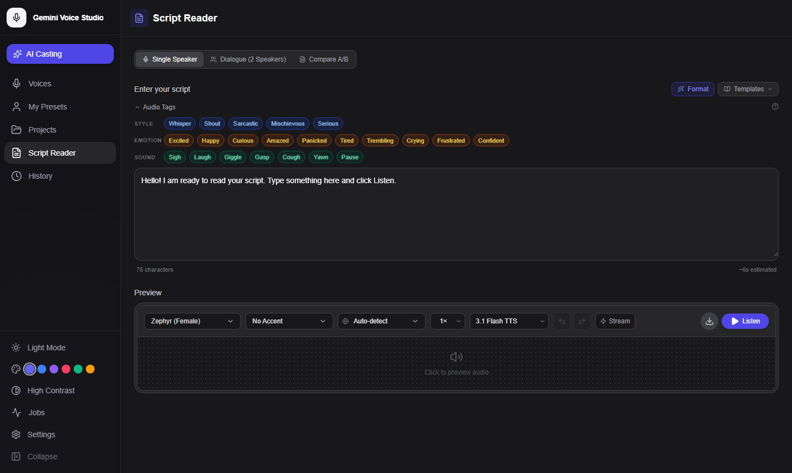
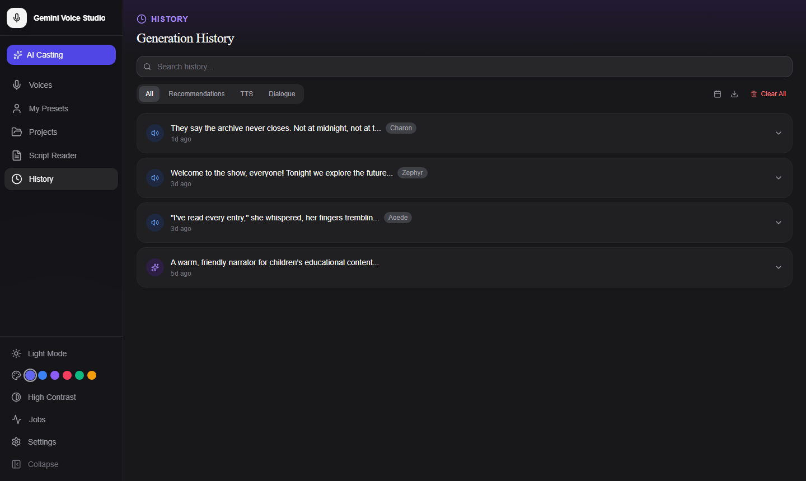
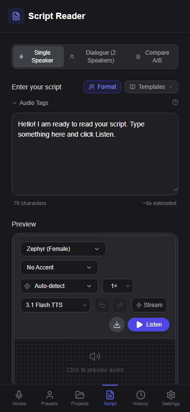

# Script Reader

The Script Reader lets you generate speech from any text using any stock or custom voice. It supports single-speaker narration, two-voice dialogue, A/B voice comparison, audio delivery tags, 70+ languages, and streaming playback.


*Script Reader — single speaker mode with voice picker, accent selector, and audio preview*

---

## Opening the Script Reader

Click the **Script Reader** item in the left navigation sidebar. The Script Reader opens as its own full-page view.

---

## Generation Modes

### Single Speaker

The default mode. Enter text, select a voice, and generate.

1. Type or paste your script in the text area
2. Select a **voice** from the stock library or your custom presets
3. Select an **accent** (optional)
4. Select a **language** (optional; auto-detected if omitted)
5. Click **Generate** — audio plays automatically when ready

### Dialogue Mode

Assign two distinct voices to speaker labels for natural conversation.

1. Click the **Dialogue** tab above the script area
2. Enter script text with speaker labels, e.g.:
   ```
   HOST: Welcome back to the show.
   GUEST: Great to be here.
   HOST: Let's dive right in.
   ```
3. Assign **Voice A** to the first speaker label and **Voice B** to the second
4. Click **Generate** — the backend renders each speaker's lines with the correct voice and stitches them into a single audio stream

### A/B Compare

Generate the same text with two different voices side by side to make a direct casting comparison.

1. Click the **Compare A/B** tab
2. Enter text in the script area
3. Select **Voice A** and **Voice B** independently from the dropdowns
4. Click the play button under each voice to generate and listen
5. Click **+ Add voice to compare** to include a third voice
6. Download any result as a WAV file


*Compare A/B mode renders each voice independently so you can audition them against the same text*

---

## Selecting a Voice

The voice picker shows both stock voices and your custom presets in a grouped dropdown:

- **Stock voices** — All 30 Gemini TTS voices (Zephyr, Puck, Charon, etc.)
- **My voices** — Your saved custom presets, labeled by name

---

## Accent Selector

Choose from 16 world English accents to shape the voice's regional delivery. The selected accent is injected as a Director's Notes instruction into the TTS system prompt.

| Code | Accent |
|------|--------|
| `en-US` | General American |
| `en-GB` | British RP |
| `en-AU` | Australian |
| `en-IE` | Irish |
| `en-NZ` | New Zealand |
| `en-ZA` | South African |
| `en-IN` | Indian English |
| `en-CA` | Canadian |
| `en-JM` | Jamaican |
| `en-NG` | Nigerian |
| `en-PH` | Philippine |
| `en-GH` | Ghanaian |
| `en-SG` | Singapore |
| `en-PK` | Pakistani |
| `en-KE` | Kenyan |
| `en-HK` | Hong Kong |

---

## Language Selection

The language dropdown lets you generate speech in 70+ languages. Select a language code or leave it on **Auto-detect** to let Gemini infer the language from your script text.

Common languages include Arabic (`ar`), Chinese Simplified (`zh-CN`), French (`fr`), German (`de`), Hindi (`hi`), Japanese (`ja`), Korean (`ko`), Spanish (`es`), and Portuguese (`pt`).

---

## Audio Tags

Insert inline delivery annotations directly into script text to shape performance without changing the words.

### Opening the Toolbar

Click the **Audio Tags** section header above the script area to expand the tag toolbar. Tags are grouped into three categories:


*The Audio Tags toolbar organizes tags by category — click any tag to insert it at the cursor*

**Style:**
- `[whispers]` — Hushed, intimate delivery
- `[shouts]` — Raised, projected voice
- `[sighs]` — Audible exhale before or after line
- `[slowly]` — Deliberate, measured pace
- `[quickly]` — Rapid, urgent delivery

**Emotion:**
- `[excited]` — High energy, upbeat
- `[sad]` — Subdued, downcast
- `[angry]` — Tense, forceful
- `[cheerful]` — Warm, bright
- `[serious]` — Grave, measured

**Sound:**
- `[laughs]` — Natural laughter
- `[chuckles]` — Restrained laugh
- `[pauses]` — Explicit pause marker
- `[clears throat]` — Throat-clearing sound

### Using Tags

Click any tag button to insert it at the cursor position in the script text area. You can also type tags manually anywhere in the script.

**Script Syntax Highlighting** colors audio tags in real time so they're visually distinct from spoken text.

### Example

```
[cheerfully] Good morning! [pauses] I hope you slept well.
[sighs] It's going to be a long day. [slowly] But we'll get through it.
```

---

## Script Templates

Click the **Templates** button to browse built-in starter scripts for common formats:

- News broadcast anchor intro
- Audiobook narration opening
- Commercial voice-over
- E-learning module introduction
- Podcast episode intro

Select a template to populate the script area, then edit to suit.

---

## AI Script Formatting

The **Format** button (magic wand icon) sends your script to Gemini for AI-powered normalization:

- Cleans up irregular whitespace and line breaks
- Normalizes punctuation and quotation marks
- Standardizes speaker label format for Dialogue mode
- Corrects common abbreviations for better TTS pronunciation

The formatted script replaces the content in the text area; the original is undoable with **Cmd/Ctrl+Z**.

---

## Drag & Drop

Drop a `.txt` or `.md` file directly onto the script text area to load its contents. Markdown heading structure is preserved as plain text.

---

## Streaming TTS

Toggle **Stream** to start playback before the full audio is generated. The audio buffer fills progressively as data arrives from the backend.

Streaming is useful for long scripts where you want immediate feedback without waiting for the full render.

---

## Playback Controls

After generation, the audio player appears below the script area:

| Control | Function |
|---------|----------|
| Play/Pause | Start or pause playback |
| Seek bar | Click to jump to any position |
| Speed | 0.5× / 0.75× / 1× / 1.25× / 1.5× / 2× playback speed |
| Download | Save audio as a WAV file |
| Waveform | Visual representation of the audio; click to seek |

---

## WAV Download

Click **Download WAV** after generation to save the audio. The file includes a proper RIFF/WAV header at 24kHz, 16-bit, mono format — suitable for importing into any audio editor.

---

## Generation History

Every generated audio is automatically saved to **History**. Access it from the **History** item in the sidebar. History entries include:

- Script text
- Voice name and settings used
- Timestamp
- Playback and re-download options
- Delete to free up cache space


*The History panel lists all past generations with voice labels — TTS entries can be replayed directly from cache*

Use the **All / Recommendations / TTS / Dialogue** filter tabs to narrow by entry type. The search bar and date range filters let you find specific past generations quickly.

---

## Tips

- Long scripts (1,000+ words) may take several seconds to generate; use **Streaming** mode for immediate feedback
- Audio tags work best when placed at the start of a sentence or clause
- For accents, combining a specific voice with a matching accent often gives the most authentic result (e.g., Fenrir + British RP)
- Click **Save as Preset** after generation to store the voice + system instruction as a reusable custom preset
- Use the **Format** button (magic wand) to let Gemini clean up irregular whitespace, normalize punctuation, and standardize speaker labels for Dialogue mode
- Drop a `.txt` or `.md` file directly onto the script text area to load its contents without copy-pasting

---

## Mobile

On small screens (phones and narrow tablets), the Script Reader adapts to a single-column layout with the voice controls stacked below the text area. The Audio Tags toolbar collapses by default to maximize writing space.


*Mobile layout — controls stack vertically; the bottom navigation provides quick access to all sections*
