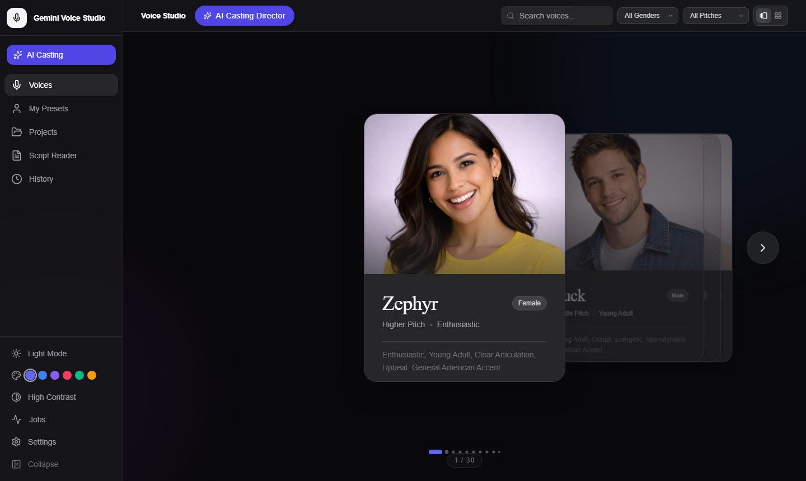
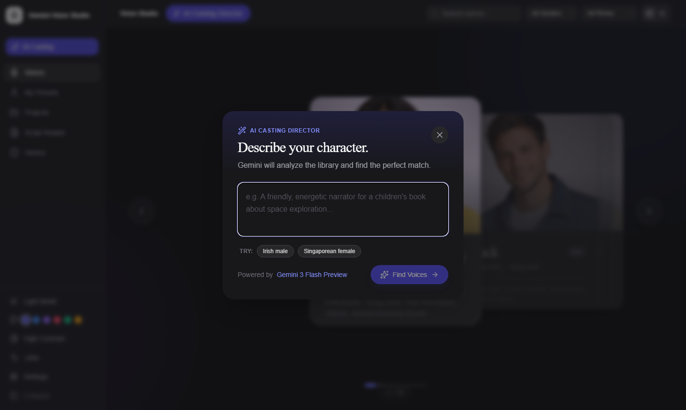
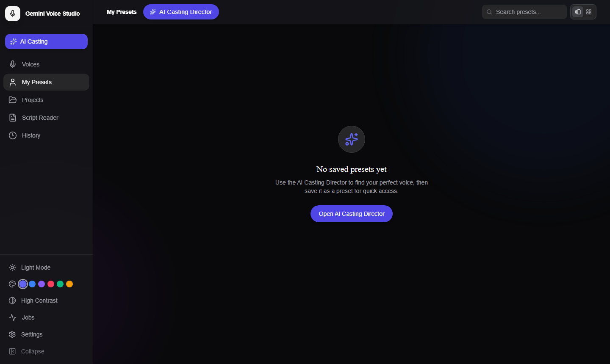

# Voice Studio

The Voice Studio is the main browsing surface for discovering, previewing, and selecting from 30 curated Google Gemini TTS voices.

*Voice Studio 3D carousel — browse all 30 voices with depth-stacked perspective*

---

## Browsing Voices

### 3D Carousel View

The default view renders voices as a depth-stacked 3D carousel with perspective projection. The active voice is centered and enlarged; adjacent voices recede into the background.

**Navigation:**
- **Arrow keys** — Move left/right through voices
- **Click a card** — Jump directly to that voice
- **Drag** — Swipe/drag horizontally to move through voices
- **Enter or Space** — Play a sample for the currently focused voice

*The 3D carousel highlights the selected voice and provides depth-cued navigation*

### Grid View

Click the **Grid** icon in the top navigation bar to switch to a responsive card grid layout.

- 1 column on mobile
- 2 columns on small screens
- 3 columns on large screens
- 4 columns on extra-large screens

Each card shows the voice portrait, name, pitch, and trait tags. Click any card to select it.

### Switching Views

The view mode toggle is in the **FilterBar** (top navigation). The selected view persists across sessions.

---

## Voice Metadata

Each voice card displays:

| Field | Description |
|-------|-------------|
| **Name** | Mythological name (e.g., Zephyr, Puck, Charon) |
| **Pitch** | Higher, Medium, or Lower |
| **Characteristics** | 2–4 short trait descriptions |
| **Gender** | Male, Female, or Neutral (from analysis) |
| **Image** | AI-generated portrait artwork |

Click any card to see the full detail view including the complete trait list and audio controls.

---

## Filtering Voices

The **FilterBar** at the top provides three filter controls:

| Filter | Options |
|--------|---------|
| **Search** | Free-text search across voice name and characteristics |
| **Gender** | All, Male, Female, Neutral |
| **Pitch** | All, Higher, Medium, Lower |

Filters are applied simultaneously. The voice count shown updates as filters change.

---

## Favorites

Click the **star icon** on any voice card to mark it as a favorite.

- Favorites are stored server-side and persist across sessions and devices
- Filter to favorites only using the **Favorites** quick filter in the FilterBar
- Unfavorite by clicking the star again

---

## Voice Samples

Each voice has a **pre-recorded audio sample** hosted by Google. Click the **Play** button on any voice card to hear it.

- Samples use standard `<audio>` elements for low-overhead playback
- The **Mini Player** (bottom of screen) shows currently playing audio and lets you control it from anywhere in the app

---

## Voice Comparison

The **Compare A/B** feature lets you hear the same text delivered by two different voices side by side — ideal for making final casting decisions.

Open the Script Reader (sidebar → **Script Reader**) and click the **Compare A/B** tab.

1. Enter text in the script area
2. Select **Voice A** and **Voice B** from the dropdowns
3. Click the play button under each voice to generate and listen independently
4. Click **+ Add voice to compare** to compare a third voice
5. Download any result as a WAV file

---

## AI Casting Director

For situations where you know what you *want* but not which voice fits, the **AI Casting Director** uses Gemini to analyze your character description and recommends the best-matching voices from the 30-voice library.

*The AI Casting Director accepts natural language descriptions and returns ranked voice recommendations*

**To open the AI Casting Director:**
- Click **AI Casting Director** in the top navigation bar, or
- Click the **AI Casting** button in the left sidebar

**How it works:**
1. Type a description of your character or narrator in the text area (e.g., *"A world-weary British detective, late 40s, with a dry sense of humour"*)
2. Try a chip suggestion (e.g., "Irish male", "Singaporean female") to get started quickly
3. Click **Find Voices** — Gemini analyzes the library and returns the top 3 matches with reasoning
4. Preview each recommendation with the TTS generator
5. Save a recommendation as a custom preset via **Save as My Voice**

---

## My Voices (Custom Presets)

The **My Voices** tab shows your saved custom voice presets — stock voices combined with specific persona system instructions that shape their character.

*The My Voices browser uses the same carousel and grid layouts as the stock Voice Library*

Click **My Voices** in the left sidebar to browse your presets. Custom presets support the same 3D carousel and grid views as the stock library and can be used anywhere a voice selection is required.

To create a preset:
1. Run the AI Casting Director and find a good recommendation
2. Click **Save as My Voice** on the result card
3. Give the preset a name — it appears in the My Voices browser and all voice pickers

---

## Navigation Tips

- Use **Cmd/Ctrl+K** to open the Command Palette and type a voice name to jump directly to it
- The **Onboarding Tour** (accessible from **Help** in the sidebar) covers the Voice Studio in its first step
